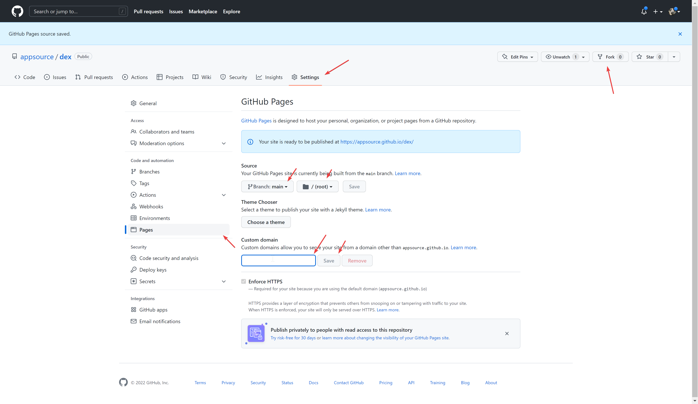

# ERC20, BEP20 exchange creation tool

DEX White-label at your own domain. Without coding skills. 2 CLICK INSTALLATION, JUST FORK AND ADD DOMAIN.
Compatible with all EVM networks.

# Price: Start for FREE

Once you start earning from this app, we will charge only 1/5 of your profit (not volume). Alternatively, you can avoid this fee by purchasing the premium version (https://onout.org/dex/) of the tool. Our RevShare model offers several benefits, including the ability to start using the tools for free, only paying for them when they generate profit. This means you can test out the tools without any upfront costs.

# Howto

1. fork this repo
2. go to settings (check the address github/YOURNAME/dex, not https://github.com/appsource/dex/!) and enable Github pages
   
3. add your "custom domain"

# Your custom settings

You need to edit values of these customizations are for your own use. Open `index.html` in the root of the main directory and just add this global script somewhere between `<head>` and `</head>`:
> This file is minified. The file is minified, so you can use some service to make it readable. For example: https://webformatter.com/html

```html
<script type="text/javascript">
  window.SO_Definance = {}
  window.SO_Definance.masterAddress = '<EVM address>'
  window.SO_Definance.chainIds = ["56","137","250"]
  window.ONOUT_refport = 'https://refport.onout.org/'
  window.ONOUT_chatidForRefport = 1232131232
</script>
```

- `<EVM address>`: your blockchain address that will be able to access admin settings inside the app
- `["56","137","250"]`: networks you want to be shown.
  To add a private chain please contact https://t.me/onoutsupportbot or email **support@onout.org** ([Read more](https://support.onout.org/hc/1331700057/32/addnewnetwork?category_id=8))

- `ONOUT_refport`: url to send logs about connected address and his referrer (for social referral network activities). Remove this line or comment to disable reports
- `ONOUT_chatidForRefport`: id of your chat where you have added @testonoutbot who will send you reports. Add @getmyid_bot to your group to get the ID.
  

# Update your version

Run github codespace with 16gb RAM then:

```bash
git clone https://github.com/noxonsu/unifactory
cd unifactory
nvm use 16
nvm install
npm i
npm run build_clean
```

Move files from build folder to this repository root folder (don't forget to `rm -rf unifactory`)

```bash
rsync -av --remove-source-files ./build/ ../
cd ..
rm -rf unifactory
```

`If you have some questions in this project, feel free to reach out.`
